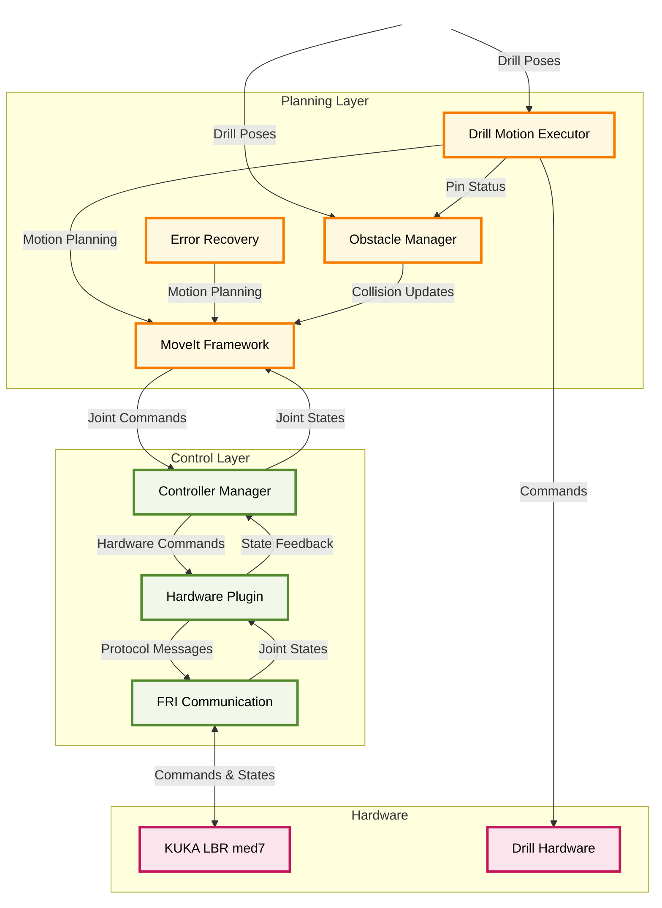

```mermaid
graph TB
    subgraph Planning["Planning Layer"]
        DME["Drill Motion Executor"]
        OM["Obstacle Manager"]
        ERR["Error Recovery"]
        MOVEIT["MoveIt Framework"]
    end

    subgraph Control["Control Layer"]
        CM["Controller Manager"]
        HP["Hardware Plugin"]
        FRI["FRI Communication"]
    end

    subgraph Hardware["Hardware"]
        LBR["KUKA LBR med7"]
        ARDUINO["Drill Hardware"]
    end

    %% External Input (no source box)
    DRILL_POSES[" "]
    DRILL_POSES -->|"Drill Poses"| DME
    DRILL_POSES -->|"Drill Poses"| OM

    %% Planning Layer Internal
    DME -->|"Pin Status"| OM
    DME -->|"Commands"| ARDUINO
    DME -->|"Motion Planning"| MOVEIT
    ERR -->|"Motion Planning"| MOVEIT
    OM -->|"Collision Updates"| MOVEIT

    %% Planning to Control
    MOVEIT -->|"Joint Commands"| CM
    CM -->|"Hardware Commands"| HP
    HP -->|"Protocol Messages"| FRI

    %% Control to Hardware
    FRI <-->|"Commands & States"| LBR

    %% Feedback Loop
    FRI -->|"Joint States"| HP
    HP -->|"State Feedback"| CM
    CM -->|"Joint States"| MOVEIT

    %% Styling
    classDef planningLayer fill:#fff8e1,stroke:#f57c00,stroke-width:3px,color:#000
    classDef controlLayer fill:#f1f8e9,stroke:#558b2f,stroke-width:3px,color:#000
    classDef hardwareLayer fill:#fce4ec,stroke:#c2185b,stroke-width:3px,color:#000
    classDef invisible fill:transparent,stroke:transparent,color:transparent

    class DME,OM,ERR,MOVEIT planningLayer
    class CM,HP,FRI controlLayer
    class LBR,ARDUINO hardwareLayer
    class DRILL_POSES invisible

```