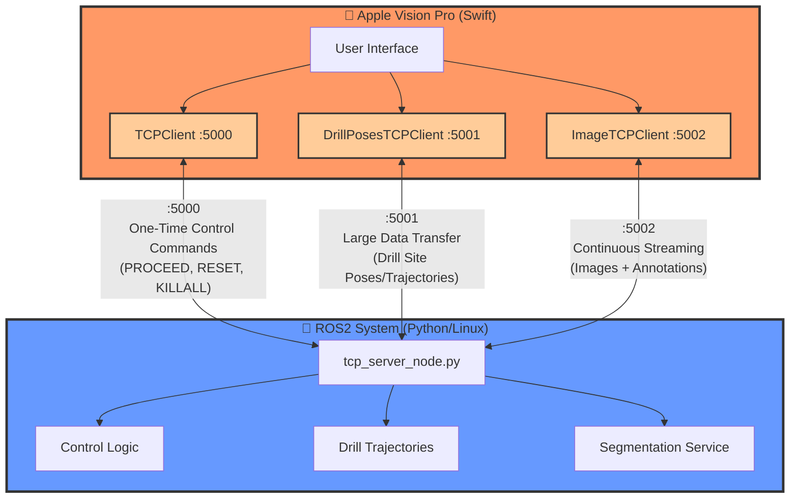
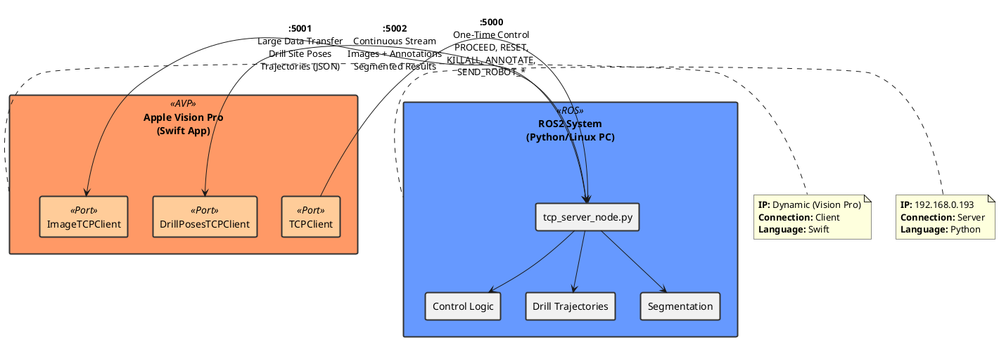

# TCP Communication Architecture

## System Overview
Communication between Apple Vision Pro (Swift) and ROS2 System (Python) via TCP on 3 ports.

---

## 1. Mermaid Diagram



---

## 2. ASCII Diagram

```
┌─────────────────────────────────────────────────────────────────────────┐
│                     TCP Communication Architecture                       │
└─────────────────────────────────────────────────────────────────────────┘

    ┌───────────────────────┐                    ┌──────────────────────┐
    │   Apple Vision Pro    │                    │    ROS2 System       │
    │      (Swift App)      │                    │   (Python/Linux)     │
    │                       │                    │                      │
    │  ┌─────────────────┐  │                    │  ┌────────────────┐  │
    │  │  UI Controls    │  │                    │  │ tcp_server_node│  │
    │  └────────┬────────┘  │                    │  └────────┬───────┘  │
    │           │           │                    │           │          │
    │  ┌────────▼────────┐  │                    │  ┌────────▼───────┐  │
    │  │ TCPClient :5000 ├──┼────────────────────┼─►│  Port 5000     │  │
    │  │  (Control)      │  │  One-Time Commands │  │  (Commands)    │  │
    │  └─────────────────┘  │  PROCEED, RESET,   │  └────────────────┘  │
    │                       │  KILLALL, etc.     │                      │
    │  ┌─────────────────┐  │                    │  ┌────────────────┐  │
    │  │DrillPosesTCP    │◄─┼────────────────────┼──┤  Port 5001     │  │
    │  │Client :5001     │  │  Large Data Xfer   │  │ (Drill Poses)  │  │
    │  └─────────────────┘  │  Trajectories/Poses│  └────────────────┘  │
    │                       │                    │                      │
    │  ┌─────────────────┐  │                    │  ┌────────────────┐  │
    │  │ ImageTCPClient  │◄─┼────────────────────┼─►│  Port 5002     │  │
    │  │   :5002         │  │  Continuous Stream │  │  (Images)      │  │
    │  └─────────────────┘  │  Images + Annot.   │  └────────────────┘  │
    │                       │                    │                      │
    └───────────────────────┘                    └──────────────────────┘
    
    192.168.0.193 (ROS PC IP Address)
```

---

## 3. PlantUML Diagram



---

## Port Summary

| Port | Direction | Type | Purpose | Data Format |
|------|-----------|------|---------|-------------|
| **5000** | AVP → ROS | Command | One-time control commands | Text (command strings) |
| **5001** | ROS → AVP | Data | Large data transfer (drill poses) | JSON (trajectories) |
| **5002** | AVP ↔ ROS | Stream | Continuous image streaming | Binary (PNG) + JSON |

---

## Key Features

- **Port 5000 (Control)**: Workflow state transitions, emergency stop, annotation triggers
- **Port 5001 (Drill Poses)**: Receives computed drill trajectories from planning system
- **Port 5002 (Images)**: Bidirectional - sends images for segmentation, receives results