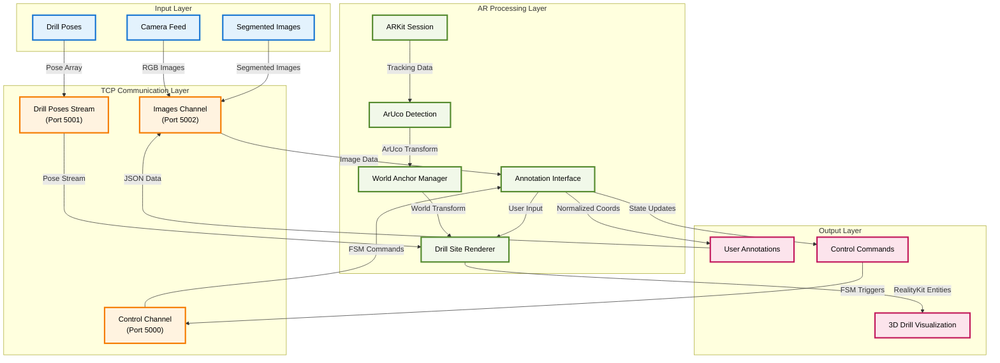

```mermaid
graph TB
    subgraph Input["Input Layer"]
        CAM["Camera Feed"]
        SEG["Segmented Images"]
        POSES["Drill Poses"]
    end

    subgraph TCP["TCP Communication Layer"]
        PORT5000["Control Channel<br/>(Port 5000)"]
        PORT5001["Drill Poses Stream<br/>(Port 5001)"]
        PORT5002["Images Channel<br/>(Port 5002)"]
    end

    subgraph AR["AR Processing Layer"]
        ARKIT["ARKit Session"]
        ARUCO["ArUco Detection"]
        ANCHOR["World Anchor Manager"]
        RENDER["Drill Site Renderer"]
        ANNOT["Annotation Interface"]
    end

    subgraph Output["Output Layer"]
        VIS["3D Drill Visualization"]
        ANNOTATIONS["User Annotations"]
        COMMANDS["Control Commands"]
    end

    %% Input to TCP
    CAM -->|"RGB Images"| PORT5002
    SEG -->|"Segmented Images"| PORT5002
    POSES -->|"Pose Array"| PORT5001

    %% TCP to AR Processing
    PORT5002 -->|"Image Data"| ANNOT
    PORT5001 -->|"Pose Stream"| RENDER
    PORT5000 -->|"FSM Commands"| ANNOT

    %% AR Processing Internal
    ARKIT -->|"Tracking Data"| ARUCO
    ARUCO -->|"ArUco Transform"| ANCHOR
    ANCHOR -->|"World Transform"| RENDER
    ANNOT -->|"User Input"| RENDER

    %% AR Processing to Output
    RENDER -->|"RealityKit Entities"| VIS
    ANNOT -->|"Normalized Coords"| ANNOTATIONS
    ANNOT -->|"State Updates"| COMMANDS

    %% Output back to TCP
    ANNOTATIONS -->|"JSON Data"| PORT5002
    COMMANDS -->|"FSM Triggers"| PORT5000

    %% Styling
    classDef inputLayer fill:#e3f2fd,stroke:#1976d2,stroke-width:3px,color:#000
    classDef tcpLayer fill:#fff3e0,stroke:#f57c00,stroke-width:3px,color:#000
    classDef arLayer fill:#f1f8e9,stroke:#558b2f,stroke-width:3px,color:#000
    classDef outputLayer fill:#fce4ec,stroke:#c2185b,stroke-width:3px,color:#000

    class CAM,SEG,POSES inputLayer
    class PORT5000,PORT5001,PORT5002 tcpLayer
    class ARKIT,ARUCO,ANCHOR,RENDER,ANNOT arLayer
    class VIS,ANNOTATIONS,COMMANDS outputLayer
```
